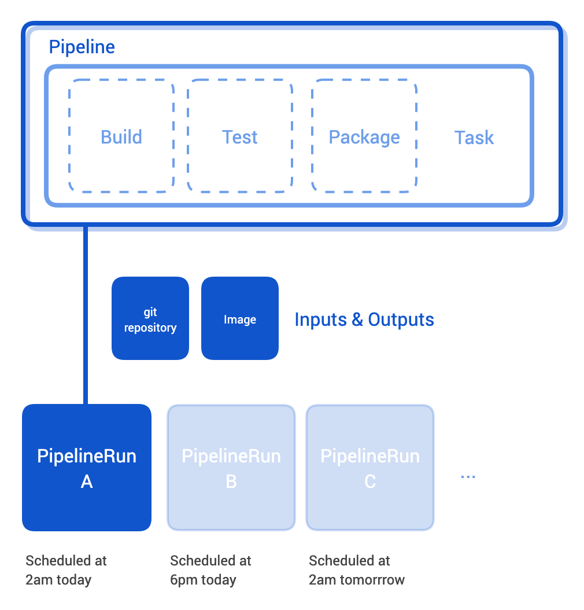

References
========

[Documentation based on](https://tekton.dev/docs/concepts/overview/)

[From Html to Markdown](https://codebeautify.org/html-to-markdown)

What is Tekton?
----------------------------------

Tekton is a cloud-native solution for building CI/CD pipelines. It consists of Tekton Pipelines, which provides the building blocks, and of supporting components, such as Tekton CLI and Tekton Catalog, that make Tekton a complete ecosystem. Tekton is part of the [CD Foundation](https://cd.foundation/), a [Linux Foundation](https://www.linuxfoundation.org/projects/) project.

Tekton installs and runs as an extension on a Kubernetes cluster and comprises a set of Kubernetes Custom Resources that define the building blocks you can create and reuse for your pipelines. Once installed, Tekton Pipelines becomes available via the Kubernetes CLI (kubectl) and via API calls, just like pods and other resources.

What are the benefits of Tekton?
--------------------------------------------------------------------

Tekton provides the following benefits to builders and users of CI/CD systems:

*   **Customizable.** Tekton entities are fully customizable, allowing for a high degree of flexibility. Platform engineers can define a highly detailed catalog of building blocks for developers to use in a wide variety of scenarios.
*   **Reusable.** Tekton entities are fully portable, so once defined, anyone within the organization can use a given pipeline and reuse its building blocks. This allows developers to quickly build complex pipelines without “reinventing the wheel.”
*   **Expandable.** Tekton Catalog is a community-driven repository of Tekton building blocks. You can quickly create new and expand existing pipelines using pre-made components from the Tekton Catalog.
*   **Standardized.** Tekton installs and runs as an extension on your Kubernetes cluster and uses the well-established Kubernetes resource model. Tekton workloads execute inside Kubernetes containers.
*   **Scalable.** To increase your workload capacity, you can simply add nodes to your cluster. Tekton scales with your cluster without the need to redefine your resource allocations or any other modifications to your pipelines.

What are the components of Tekton?
------------------------------------------------------------------------

Tekton consists of the following components:

*   **[Tekton Pipelines](https://github.com/tektoncd/pipeline/blob/main/docs/README.md)** is the foundation of Tekton. It defines a set of Kubernetes [Custom Resources](https://kubernetes.io/docs/concepts/extend-kubernetes/api-extension/custom-resources/) that act as building blocks from which you can assemble CI/CD pipelines.

*   **[Tekton Triggers](https://github.com/tektoncd/triggers/blob/main/README.md)** allows you to instantiate pipelines based on events. For example, you can trigger the instantiation and execution of a pipeline every time a PR is merged against a GitHub repository. You can also build a user interface that launches specific Tekton triggers.

*   **[Tekton CLI](https://github.com/tektoncd/cli/blob/main/README.md)** provides a command-line interface called `tkn`, built on top of the Kubernetes CLI, that allows you to interact with Tekton.

*   **[Tekton Dashboard](https://github.com/tektoncd/dashboard/blob/main/docs/README.md)** is a Web-based graphical interface for Tekton Pipelines that displays information about the execution of your pipelines. It is currently a work-in-progress.

*   **[Tekton Catalog](https://github.com/tektoncd/catalog/blob/v1beta1/README.md)** is a repository of high-quality, community-contributed Tekton building blocks - `Tasks`, `Pipelines`, and so on - that are ready for use in your own pipelines.

*   **[Tekton Hub](https://github.com/tektoncd/hub/blob/main/README.md)** is a Web-based graphical interface for accessing the Tekton Catalog.

*   **[Tekton Operator](https://github.com/tektoncd/operator/blob/main/README.md)** is a Kubernetes [Operator pattern](https://operatorhub.io/what-is-an-operator) that allows you to install, update, and remove Tekton projects on your Kubernetes cluster.

How do I work with Tekton?
--------------------------------------------------------

To install Tekton, you need a Kubernetes cluster running a [version of Kubernetes specified for the current Tekton release](https://github.com/tektoncd/pipeline/#want-to-start-using-pipelines). Once installed, you can interact with Tekton using one of the following:

*   **[The tkn CLI](https://github.com/tektoncd/cli/blob/main/README.md)**, also known as the Tekton CLI, is the preferred command-line method for interacting with Tekton. `tkn` provides a quick and streamlined experience, including high-level commands and color coding. To use it, you only need to be familiar with Tekton.
*   **[The kubectl CLI](https://kubernetes.io/docs/reference/kubectl/overview/)**, also known as the Kubernetes CLI, provides substantially more granularity for controlling Tekton at the expense of higher complexity. Interacting with Tekton via kubectl is typically reserved for debugging your pipelines and troubleshooting your builds.
*   **[The Tekton APIs](https://kubernetes.io/docs/tasks/access-kubernetes-api/custom-resources/custom-resource-definitions/)**, currently available for [Pipelines](https://pkg.go.dev/github.com/tektoncd/pipeline/pkg/apis/pipeline/v1beta1?tab=doc) and [Triggers](https://pkg.go.dev/github.com/tektoncd/triggers@v0.5.0/pkg/apis/triggers/v1alpha1?tab=doc), allow you to programmatically interact with Tekton components. This is typically reserved for highly customized CI/CD systems. In most scenarios, `tkn` and `kubectl` are the preferred methods of controlling Tekton.

We also recommend having the following items configured on your Kubernetes cluster:

*   Persistent volume claims for specifying inputs and outputs.
*   Permissions appropriate to your environment and business needs.
*   Storage for building and pushing images (if applicable).

What can I do with Tekton?
--------------------------------------------------------

Tekton introduces the concept of `Tasks`, which specify the workloads you want to run:

*   [`Task`](https://github.com/tektoncd/pipeline/blob/main/docs/tasks.md) - defines a series of ordered `Steps`, and each `Step` invokes a specific build tool on a specific set of inputs and produces a specific set of outputs, which can be used as inputs in the next `Step`.

*   [`Pipeline`](https://github.com/tektoncd/pipeline/blob/main/docs/pipelines.md) - defines a series of ordered `Tasks`, and just like `Steps` in a `Task`, a `Task` in a `Pipeline` can use the output of a previously executed `Task` as its input.

*   [`TaskRun`](https://github.com/tektoncd/pipeline/blob/main/docs/taskruns.md) - instantiates a specific `Task` to execute on a particular set of inputs and produce a particular set of outputs. In other words, the `Task` tells Tekton what to do, and a `TaskRun` tells Tekton what to do it **on**, as well as any additional details on how to exactly do it, such as build flags.

*   [`PipelineRun`](https://github.com/tektoncd/pipeline/blob/main/docs/pipelineruns.md) - instantiates a specific `Pipeline` to execute on a particular set of inputs and produce a particular set of outputs to particular destinations.

Each `Task` executes in its own Kubernetes Pod. Thus, by default, `Tasks` within a `Pipeline` do not share data. To share data among `Tasks`, you must explicitly configure each `Task` to make its outputs available to the next `Task` and to ingest the outputs of a previously executed `Task` as its inputs, whichever is applicable.

### When to use which?

*   `Task` - useful for simpler workloads such as running a test, a lint, or building a Kaniko cache. A single `Task` executes in a single Kubernetes Pod, uses a single disk, and generally keeps things simple.
*   `Pipeline` - useful for complex workloads, such as static analysis, as well as testing, building, and deploying complex projects.

1.  [Documentation](https://tekton.dev/docs/)
2.  [Concepts](https://tekton.dev/docs/concepts/)
3.  [Concept model](https://tekton.dev/docs/concepts/concept-model/)

Concept model
=============

Basic Tekton components and data model

Steps, Tasks, and Pipelines
---------------------------------------------------------

A **step** is an operation in a CI/CD workflow, such as running some unit tests for a Python web app, or the compilation of a Java program. Tekton performs each step with a container image you provide. For example, you may use the [official Go image](https://hub.docker.com/_/golang) to compile a Go program in the same manner as you would on your local workstation (`go build`).

A **task** is a collection of **steps** in order. Tekton runs a task in the form of a [Kubernetes pod](https://kubernetes.io/docs/concepts/workloads/pods/), where each step becomes a running container in the pod. This design allows you to set up a shared environment for a number of related steps; for example, you may mount a [Kubernetes volume](https://kubernetes.io/docs/concepts/storage/volumes/) in a task, which will be accessible inside each step of the task.

A **pipeline** is a collection of **tasks** in order. Tekton collects all the tasks, connects them in a directed acyclic graph (DAG), and executes the graph in sequence. In other words, it creates a number of Kubernetes pods and ensures that each pod completes running successfully as desired. Tekton grants developers full control of the process: one may set up a fan-in/fan-out scenario of task completion, ask Tekton to retry automatically should a flaky test exists, or specify a condition that a task must meet before proceeding.

**Tasks** and **pipelines** are specified as [custom resources](https://kubernetes.io/docs/concepts/extend-kubernetes/api-extension/custom-resources/) in a Kubernetes cluster.

TaskRuns and PipelineRuns
-------------------------------------------------------

A **pipelineRun**, as its name implies, is a specific execution of a **pipeline**. For example, you may ask Tekton to run your CI/CD workflow twice a day, and each execution will become a **pipelineRun** resource trackable in your Kubernetes cluster. You can view the status of your CI/CD workflow, including the specifics of each task execution with **pipelineRuns**.

Similarly, a **taskRun** is a specific execution of a **task**. **TaskRuns** are also available when you choose to run a task outside a pipeline, with which you may view the specifics of each step execution in a task.

**TaskRuns** and **pipelineRuns** connect **resources** with **tasks** and **pipelines**. A run must include the actual addresses of resources, such as the URLs of repositories, its task or pipeline needs. This design allows developers to reuse tasks and pipelines for different inputs and outputs.

You may create **taskRuns** or **pipelineRuns** manually, which triggers Tekton to run a task or a pipeline immediately. Alternately, one may ask a Tekton component, such as Tekton Triggers, to create a run automatically on demand; for example, you may want to run a pipeline every time a new pull request is checked into your git repository.

**TaskRuns** and **pipelineRuns** are specified as [custom resources](https://kubernetes.io/docs/concepts/extend-kubernetes/api-extension/custom-resources/) in a Kubernetes cluster.

How Tekton works
-------------------------------------

Loosely speaking, at its core, Tekton Pipelines functions by wrapping each of your steps. More specifically, Tekton Pipelines injects an `entrypoint` binary in step containers, which executes the command you specify when the system is ready.

Tekton Pipelines tracks the state of your pipeline using [Kubernetes Annotations](https://kubernetes.io/docs/concepts/overview/working-with-objects/annotations/). These annotations are projected inside each step container in the form of files with the [Kubernetes Downward API](https://kubernetes.io/docs/tasks/inject-data-application/downward-api-volume-expose-pod-information/#the-downward-api). The `entrypoint` binary watches the projected files closely, and will only start the provided command if a specific annotation appears as files. For example, when you ask Tekton to run two steps consecutively in a task, the `entrypoint` binary injected into the second step container will wait idly until the annotations report that the first step container has successfully completed.

In addition, Tekton Pipelines schedules some containers to run automatically before and after your step containers, so as to support specific built-in features, such as the retrieval of input resources and the uploading of outputs to blob storage solutions. You can track their running statuses as well via **taskRuns** and **pipelineRuns**. The system also performs a number of other operations to set up the environment before running the step containers; for more information, see [Tasks and Pipelines](/docs/pipelines).

## Tutorial steps

* [Installation on Openshift](https://tekton.dev/docs/pipelines/install/#installing-tekton-pipelines-on-openshift)
* [Installation on Openshift method 2](https://github.com/openshift/pipelines-tutorial/blob/master/install-operator.md)
* [OpenShift Coffee Break: Absolute Beginners guide to Tekton (YouTube)](https://www.youtube.com/watch?v=c2pcTQL97J0)